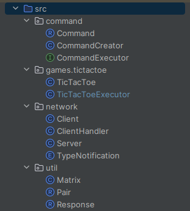

# Game Chat

Game Chat е платформа, където множество потребители могат да се свързват и да се забавляват. 
Тук потребителите имат възможността да играят игри за двама помежду си. В момента чатът 
поддържа само играта TicTacToe, където всеки клиент (играч) може да създава игра с 
друг клиент.

## Архитектура:

Проектът е организиран в различни пакети, като всяка група от файлове 
има свое предназначение и функционалност.

1. ##### command: Този пакет съдържа класове, отговорни за обработката на текстови команди, предоставяни от потребителя.
    1. `Command.java` - дефинира модела на командата.
    2. `CommandCreator.java` - създава инстанции на команди от текстови входове.
    3. `CommandExecutor.java` - изпълнява командите, предавани от потребителя.
2. ##### games.tictactoe: В този пакет се съдържат файлове, които управляват играта TicTacToe.
   1. `TicTacToe.java` - дефинира правилата и състоянието на играта.
   2. `TicTacToeExecutor.java` - изпълнява командите свързани с TicTacToe и поддържа активните игри. 
3. ##### network: Този пакет обхваща файлове, които управляват комуникацията между клиенти и сървър.
   1. `Client.java` - представлява клиентската част на комуникацията.
   2. `ClientHandler.java` - обработва комуникацията от страна на сървъра за всеки клиент.
   3. `Server.java` - предоставя сървърна част за приемане на входящи връзки от клиенти.
   4. `TypeNotification.java` - дефинира типове за уведомления при комуникация.
4. ##### util: В този пакет се намират помощни класове, които се използват от различни части на приложението. 
   1. `Matrix.java` - представлява матрица за игровото поле или други подобни приложения.
   2. `Pair.java` - дефинира обобщен клас за двойка стойности.
   3. `Response.java` - моделира отговор от изпълнението на команда, включващ съобщение и списък от свързани клиенти.

В следващите подразделения ще разгледаме всяко от тях по-подробно.

## Пакет: command
Пакетът command е отговорен за обработката на текстови команди, предоставяни от 
потребителя. Тук се дефинират, създават и изпълняват команди. Няколко ключови 
класове в този пакет се използват за управление на командите в приложението.

1. ##### Command.java:
   Command представлява модел за съхранение на информацията за определена команда. Важни атрибути и методи включват:
   - `game()`: Връща името на играта, свързана с командата.
   - `command(int index)`: Връща част от командата по подаден индекс.
   - `toString()`: Преобразува командата в низ за по-лесно четене и разбиране.
2. ##### CommandCreator.java:
   CommandCreator отговаря за създаването на обекти от тип Command чрез обработка на текстови команди от потребителите. Включва методи като:
   - `newCommand(String input)`: Създава нов обект Command на базата на текстова команда.
3. ##### CommandExecutor.java:
   CommandExecutor изпълнява командите в контекста на играта. Важни методи са:
   - `execute(Command cmd, String currentPlayer, List<String> clients)`: Изпълнява подадената команда в играта, взимайки предвид текущия играч и списъка с клиенти.
   - `isCommand(Set<String> clients, String input)`: Проверява дали подаденият текст е команда, която може да се обработи.

Пакет: games.tictactoe
Пакетът games.tictactoe е отговорен за всичко свързано с логиката и изпълнението на играта TicTacToe.

1. ##### TicTacToe.java:
   Класът TicTacToe представлява самата игра TicTacToe. Някои от ключовите атрибути и методи включват:
   - Атрибути: 
     - `player1 и player2`: Представляват двама играчи в играта.
     - `matrix`: Представлява игралната дъска в матричен вид. 
   - Методи:
     - `turn(String currentPlayer)`: Проверява дали е текущият играч на ход.
     - `hit(String currentPlayer, int row, int column)`: Изпълнява хода на играча въз основа на подадените ред и колона.
     - `hasEnded()`: Проверява дали играта е приключила.
     - `getWinner()`: Връща победителя на играта.
2. ##### TicTacToeExecutor.java:
   TicTacToeExecutor управлява изпълнението на командите, свързани с TicTacToe. Ключовите компоненти са:
   - Команди в играта:
      - CREATE: Създава нова игра.
      - SIGN: Показва знака (X или O) на текущия играч.
      - HIT: Изпълнява ход на даден играч.
      - EXIT: Приключва играта.
      - PRINT: Извежда текущото състояние на игралната дъска.
      - HELP: Извежда списък с налични команди.
      - LIST: Извежда списък с активните игри.
      - DELETE: Изтрива дадена игра.
   - Методи:
      - `execute(Command cmd, String currentPlayer, List<String> clients)`: Изпълнява дадена команда в контекста на играта.
      - `newGame(Command command, String currentPlayer, List<String> clients)`: Създава нова игра.
      - `ifGameExist(Command command)`: Проверява дали играта съществува.
      - `delete(Command cmd, String currentPlayer)`: Изтрива игра.
      - `mySign(Command cmd, String currentPlayer)`: Връща знака на текущия играч.
      - `print(Command cmd, List<String> players, String addMessage)`: Извежда състоянието на игралната дъска.
      - `hit(Command cmd, String currentPlayer)`: Изпълнява ход на играча.
      - `exit(Command command)`: Приключва играта.
      - `help(Command command, String currentPlayer)`: Извежда списък с налични команди.
      - `listOfActiveGames(Command command, String currentPlayer)`: Извежда списък с активните игри.

## Пакет: network
Пакетът network играе ключова роля в установяването и поддържането на връзка 
между клиентите и сървъра. Включва класове, които управляват комуникацията, 
обработват съобщенията и осигуряват общ чат между потребителите.

1. ##### Client.java:
  Класът Client представлява клиентската част на приложението. Важни методи и техните функции са:
  - `sendMessage()`: Методът позволява на клиента да изпраща съобщения до сървъра. Първоначално се изпраща потребителското име, 
     а след това потребителят въвежда текстови съобщения.
  - `listenForMessage()`: Асинхронен метод, който слуша за съобщения от сървъра и ги извежда на конзолата на клиента.
  - `closeEverything()`: Затваря сокета и потоците за четене и писане в случай на грешка или прекъсване на връзката.
2. ##### ClientHandler.java:
   ClientHandler управлява връзката между сървъра и отделни клиенти. Важни методи включват:
   - `createAnInstance(Socket socket)`: Създава нов ClientHandler и стартира нишка за обработка на връзката с клиента.
   - `sendMessage(String message, TypeNotification typeNotification, Set<String> usernames)`: Изпраща съобщение до определени потребители спрямо TypeNotification.
   - `sendMessage(String message, TypeNotification typeNotification, String username)`: Изпраща съобщение до конкретен потребител.
   - `sendMessage(String message, TypeNotification typeNotification)`: Изпраща съобщение до всички потребители или до тези, различни от текущия, спрямо TypeNotification.
   - `removeClientHandler()`: Премахва текущия ClientHandler и изпраща съобщение, че потребителят е напуснал чата.
   - `isFull()`: Проверява дали чатът е пълен.
3. ##### Server.java:
   Класът Server управлява сървъра, който приема връзки от клиенти. Включва методи като:
   - `startServer()`: Началната точка на сървъра, където се приемат и обработват връзките от клиенти.
   - `closeServerSocket()`: Затваря сървърния сокет в случай на грешка или прекъсване на връзката.
4. ##### TypeNotification.java:
   Дефиниране на типове известия за съобщенията между клиентите. 
   Включва `BROADCAST` за общи известия, `OTHER_PLAYERS` за съобщения до други клиенти и `PLAYER` 
   за съобщения до конкретен клиент.

## Пакет: util
Пакетът util предоставя поддръжка на основни структури и функционалности, използвани в целия проект.

1. ##### Matrix.java:
   Класът Matrix представлява матрица, използвана за представяне на игралната дъска в TicTacToe.
   - `size`: Поле, определящо размера на матрицата (игралната дъска).
   - `matrix`: Двуизмерен масив от символи, представляващ игралната дъска.
   - `Matrix(int size)`: Конструктор, създаващ матрица с определен размер и попълващ я със зададен символ (в случая "-").
   - `validArguments(int row, int column)`: Проверява дали зададените ред и колона са валидни за матрицата.
   - `set(Character c, int row, int column)`: Задава стойност на определена клетка в матрицата.
   - `get(int row, int column)`: Връща стойността на определена клетка в матрицата.
   - `size()`: Връща размера на матрицата.
2. ##### Pair.java:
   Pair е прости клас за представяне на наредена двойка от два обекта.
   - `first и second`: Полета, съхраняващи двата обекта от наредената двойка.
   - `Pair(A first, B second)`: Конструктор, създаващ нова наредена двойка с подадените стойности.
3. ##### Response.java:
   Response представлява отговор, който съдържа текстово съобщение и списък от клиенти, които трябва да получат този отговор.
   - `message`: Текстово съобщение, което трябва да бъде изпратено.
   - `client`: Списък от клиенти, които трябва да получат съобщението.
   - `Response(String message, List<String> client)`: Конструктор, инициализиращ нов отговор със зададен текст и списък от клиенти.
