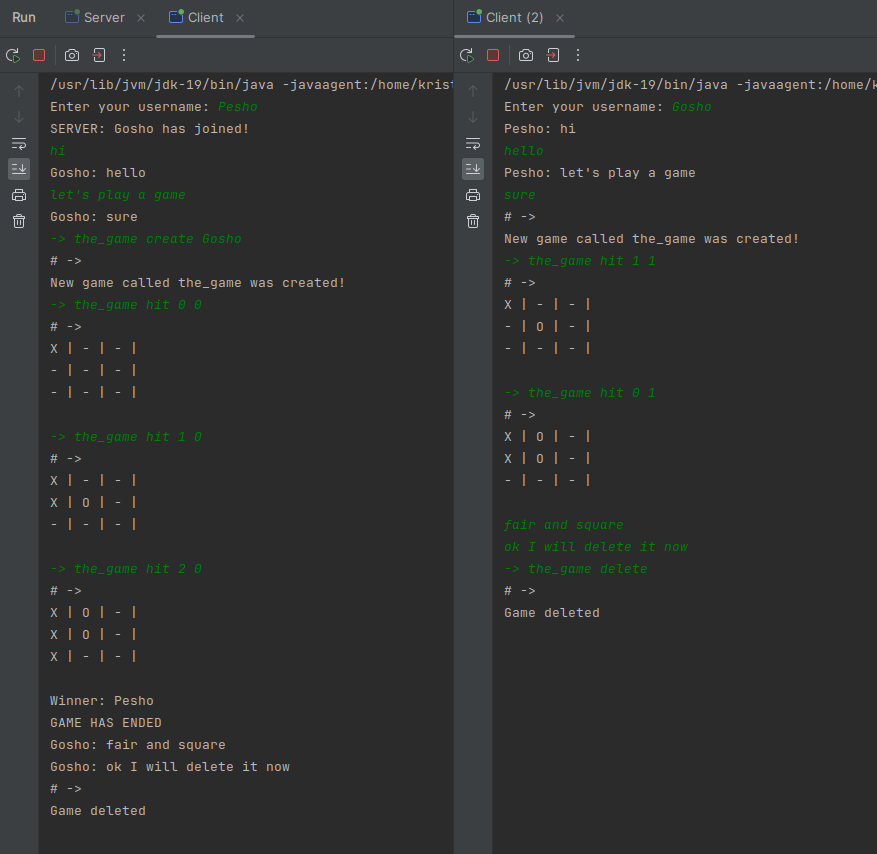

# Game Chat

**Game Chat** is a platform where multiple users can connect and have fun.
Users have the opportunity to play two-player games with each other. Currently, the chat
supports only TicTacToe, where each client (player) can create a game with
another client.

## Architecture:

The project is organized into different packages, with each group of files
having its purpose and functionality.

1. ##### command: This package contains classes responsible for processing text commands provided by the user.
    1. `Command.java` - defines the command model.
    2. `CommandCreator.java` - creates instances of commands from text inputs.
    3. `CommandExecutor.java` - executes commands submitted by the user.
2. ##### games.tictactoe: This package contains files that manage the TicTacToe game.
   1. `TicTacToe.java` - defines the rules and state of the game.
   2. `TicTacToeExecutor.java` - executes commands related to TicTacToe and maintains active games. 
3. ##### network: This package covers files that manage communication between clients and server.
   1. `Client.java` - represents the client side of communication.
   2. `ClientHandler.java` - handles communication from the server side for each client.
   3. `Server.java` - provides a server part for accepting incoming connections from clients.
   4. `TypeNotification.java` - defines types for notifications during communication.
4. ##### util: This package contains utility classes used by different parts of the application. 
   1. `Matrix.java` - represents a matrix for the game board or other similar applications.
   2. `Pair.java` - defines a generic class for a pair of values.
   3. `Response.java` - models a response from command execution, including a message and a list of associated clients.

In the following sections, we'll look at each of them in more detail.

## Package: command
The command package is responsible for processing text commands provided by 
the user. Here, commands are defined, created, and executed. Several key 
classes in this package are used to manage commands in the application.

1. ##### Command.java:
   Command represents a model for storing information about a specific command. Important attributes and methods include:
   - `game()`: Returns the name of the game associated with the command.
   - `command(int index)`: Returns part of the command by the given index.
   - `toString()`: Converts the command to a string for easier reading and understanding.
2. ##### CommandCreator.java:
   CommandCreator is responsible for creating Command objects by processing text commands from users. It includes methods such as:
   - `newCommand(String input)`: Creates a new Command object based on a text command.
3. ##### CommandExecutor.java:
   CommandExecutor executes commands in the context of the game. Important methods are:
   - `execute(Command cmd, String currentPlayer, List<String> clients)`: Executes the given command in the game, considering the current player and the list of clients.
   - `isCommand(Set<String> clients, String input)`: Checks if the given text is a command that can be processed.

## Package: games.tictactoe
The games.tictactoe package is responsible for everything related to the logic and execution of the TicTacToe game.

1. ##### TicTacToe.java:
   The TicTacToe class represents the actual TicTacToe game. Some of the key attributes and methods include:
   - Attributes: 
     - `player1 and player2`: Represent the two players in the game.
     - `matrix`: Represents the game board in matrix form. 
   - Methods:
     - `turn(String currentPlayer)`: Checks if it's the current player's turn.
     - `hit(String currentPlayer, int row, int column)`: Executes the player's move based on the given row and column.
     - `hasEnded()`: Checks if the game has ended.
     - `getWinner()`: Returns the winner of the game.
2. ##### TicTacToeExecutor.java:
   TicTacToeExecutor manages the execution of commands related to TicTacToe. Key components are:
   - Game Commands:
      - CREATE: Creates a new game.
      - SIGN: Shows the sign (X or O) of the current player.
      - HIT: Executes a player's move.
      - EXIT: Ends the game.
      - PRINT: Displays the current state of the game board.
      - HELP: Displays a list of available commands.
      - LIST: Displays a list of active games.
      - DELETE: Deletes a game.
   - Methods:
      - `execute(Command cmd, String currentPlayer, List<String> clients)`: Executes a given command in the context of the game.
      - `newGame(Command command, String currentPlayer, List<String> clients)`: Creates a new game.
      - `ifGameExist(Command command)`: Checks if the game exists.
      - `delete(Command cmd, String currentPlayer)`: Deletes a game.
      - `mySign(Command cmd, String currentPlayer)`: Returns the sign of the current player.
      - `print(Command cmd, List<String> players, String addMessage)`: Displays the state of the game board.
      - `hit(Command cmd, String currentPlayer)`: Executes a player's move.
      - `exit(Command command)`: Ends the game.
      - `help(Command command, String currentPlayer)`: Displays a list of available commands.
      - `listOfActiveGames(Command command, String currentPlayer)`: Displays a list of active games.

## Package: network
The network package plays a key role in establishing and maintaining a connection 
between clients and the server. It includes classes that manage communication, 
process messages, and provide a general chat between users.

1. ##### Client.java:
  The Client class represents the client side of the application. Important methods and their functions are:
  - `sendMessage()`: The method allows the client to send messages to the server. Initially, the username is sent, 
     and then the user enters text messages.
  - `listenForMessage()`: An asynchronous method that listens for messages from the server and displays them on the client's console.
  - `closeEverything()`: Closes the socket and the read and write streams in case of an error or connection interruption.
2. ##### ClientHandler.java:
   ClientHandler manages the connection between the server and individual clients. Important methods include:
   - `createAnInstance(Socket socket)`: Creates a new ClientHandler and starts a thread to handle the connection with the client.
   - `sendMessage(String message, TypeNotification typeNotification, Set<String> usernames)`: Sends a message to specific users based on TypeNotification.
   - `sendMessage(String message, TypeNotification typeNotification, String username)`: Sends a message to a specific user.
   - `sendMessage(String message, TypeNotification typeNotification)`: Sends a message to all users or to those different from the current one, based on TypeNotification.
   - `removeClientHandler()`: Removes the current ClientHandler and sends a message that the user has left the chat.
   - `isFull()`: Checks if the chat is full.
3. ##### Server.java:
   The Server class manages the server that accepts connections from clients. It includes methods such as:
   - `startServer()`: The starting point of the server, where connections from clients are accepted and processed.
   - `closeServerSocket()`: Closes the server socket in case of an error or connection interruption.
4. ##### TypeNotification.java:
   Defines notification types for messages between clients. 
   Includes `BROADCAST` for general notifications, `OTHER_PLAYERS` for messages to other clients, and `PLAYER` 
   for messages to a specific client.

## Package: util
The util package provides support for basic structures and functionalities used throughout the project.

1. ##### Matrix.java:
   The Matrix class represents a matrix used to represent the game board in TicTacToe.
   - `size`: Field defining the size of the matrix (game board).
   - `matrix`: Two-dimensional array of characters representing the game board.
   - `Matrix(int size)`: Constructor creating a matrix of a specific size and filling it with a given character (in this case "-").
   - `validArguments(int row, int column)`: Checks if the given row and column are valid for the matrix.
   - `set(Character c, int row, int column)`: Sets a value to a specific cell in the matrix.
   - `get(int row, int column)`: Returns the value of a specific cell in the matrix.
   - `size()`: Returns the size of the matrix.
2. ##### Pair.java:
   Pair is a simple class for representing an ordered pair of two objects.
   - `first and second`: Fields storing the two objects of the ordered pair.
   - `Pair(A first, B second)`: Constructor creating a new ordered pair with the given values.
3. ##### Response.java:
   Response represents a response containing a text message and a list of clients who should receive this response.
   - `message`: Text message to be sent.
   - `client`: List of clients who should receive the message.
   - `Response(String message, List<String> client)`: Constructor initializing a new response with a given text and list of clients.

## Example Gameplay

## Implementation Summary:
The **Game Chat** project provides functionality for multiplayer communication and gameplay. Currently, only the TicTacToe game is supported, 
but the architecture is designed with the possibility of future expansion with new games.